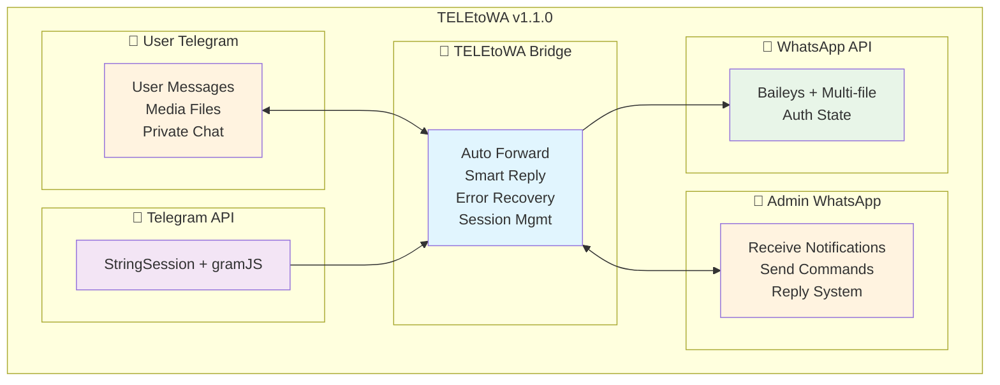
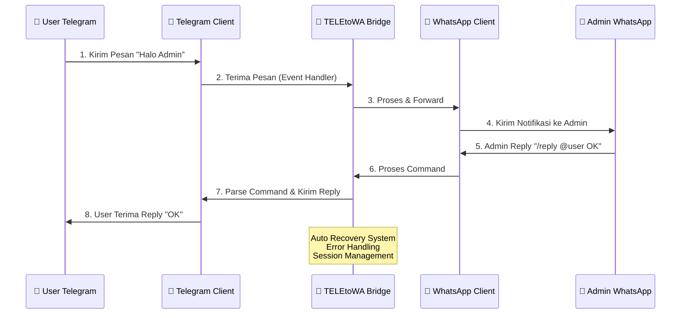
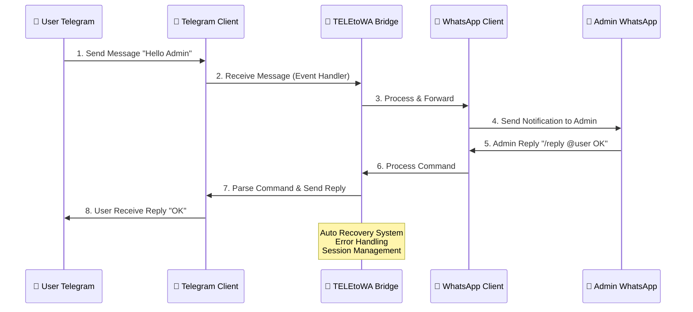
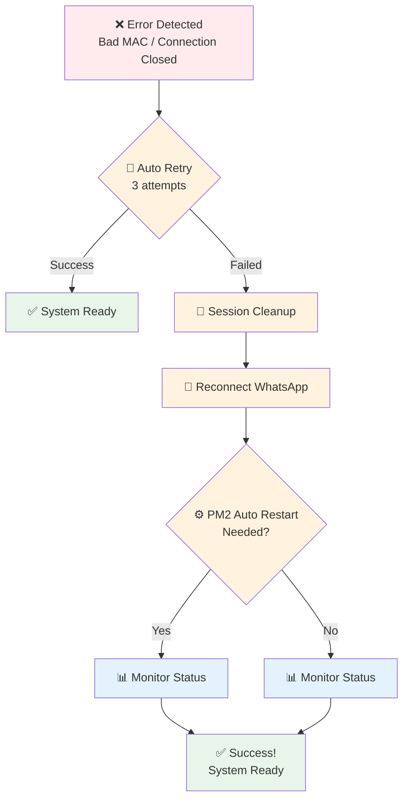
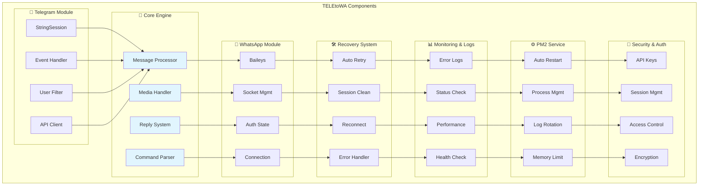
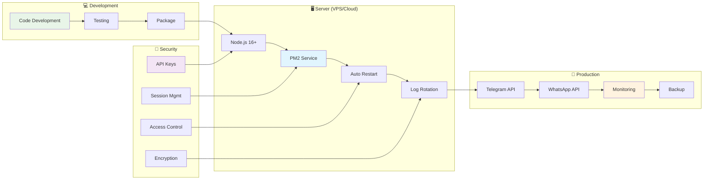
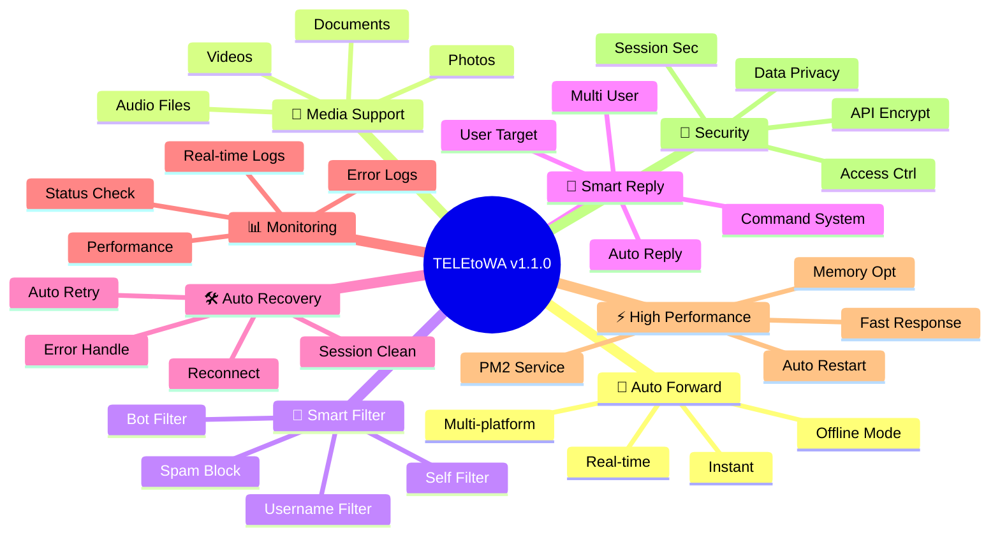

```mermaid
gantt
    title Skenario Penggunaan: Toko Online
    dateFormat  X
    axisFormat %s
    
    section Customer
    Kirim Pesan           :done, c1, 0, 2
    Kirim Foto           :done, c2, 2, 4
    Terima Reply         :done, c3, 8, 10
    
    section TELEtoWA
    Proses Pesan         :done, t1, 0, 2
    Forward ke Admin     :done, t2, 2, 4
    Proses Command       :done, t3, 6, 8
    Kirim Reply          :done, t4, 8, 10
    
    section Admin
    Terima Notifikasi    :done, a1, 4, 6
    Kirim Command        :done, a2, 6, 8
```

```mermaid
gantt
    title Use Case Scenario: Online Store
    dateFormat  X
    axisFormat %s
    
    section Customer
    Send Message         :done, c1, 0, 2
    Send Photo           :done, c2, 2, 4
    Receive Reply        :done, c3, 8, 10
    
    section TELEtoWA
    Process Message      :done, t1, 0, 2
    Forward to Admin     :done, t2, 2, 4
    Process Command      :done, t3, 6, 8
    Send Reply           :done, t4, 8, 10
    
    section Admin
    Receive Notification :done, a1, 4, 6
    Send Command         :done, a2, 6, 8
```

# 🎨 TELEtoWA Mermaid Diagrams

## 📋 Table of Contents
- [System Architecture](#system-architecture)
- [Message Flow](#message-flow)
- [Error Recovery Process](#error-recovery-process)
- [Component Interaction](#component-interaction)
- [Deployment Flow](#deployment-flow)

---

## 🏗️ System Architecture

### 🇮🇩 Bahasa Indonesia

### 🇺🇸 English

---

## 🔄 Message Flow

### 🇮🇩 Bahasa Indonesia

### 🇺🇸 English

---

## 🛠️ Error Recovery Process

### 🇮🇩 Bahasa Indonesia

### 🇺🇸 English

---

## 🔧 Component Interaction

### 🇮🇩 Bahasa Indonesia

### 🇺🇸 English

---

## 🚀 Deployment Flow

### 🇮🇩 Bahasa Indonesia

### 🇺🇸 English

---

## 📊 Feature Overview

### 🇮🇩 Bahasa Indonesia

### 🇺🇸 English

---

## 🎯 Use Case Timeline

### 🇮🇩 Bahasa Indonesia

### 🇺🇸 English

---

**📝 Note:** Mermaid diagrams ini dapat dirender di:
- 📖 GitHub README
- 📚 GitLab Wiki
- 🎯 Notion
- 📊 Confluence
- 🌐 Mermaid Live Editor 